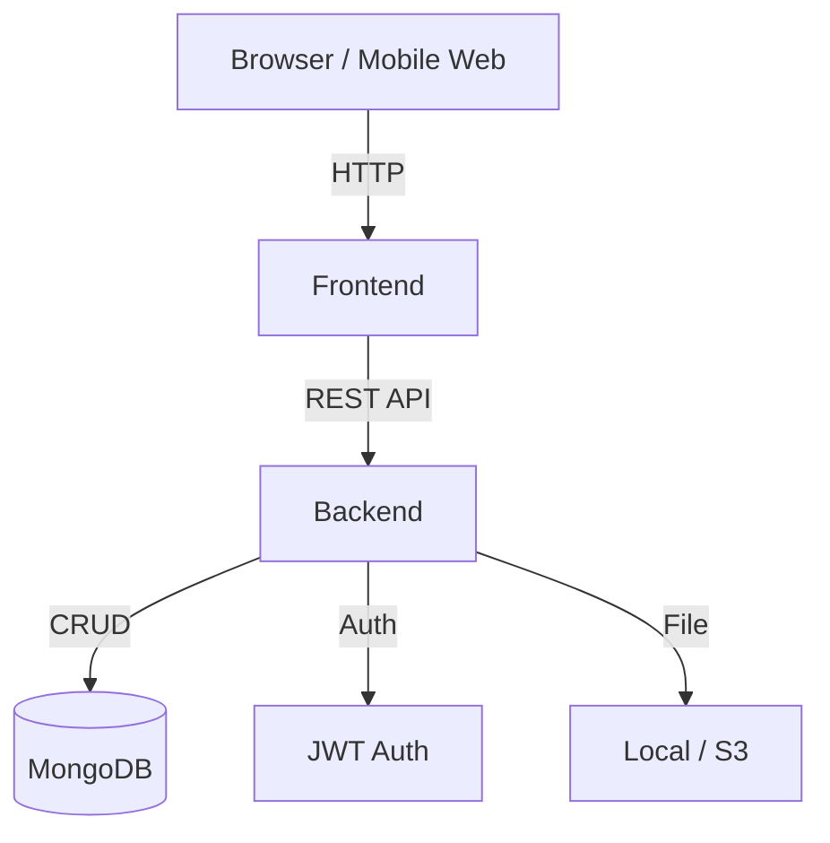

# 📄 FarmHub - Quản lý vật tư nông nghiệp

---

## 📌 Giới thiệu dự án

- **Tên dự án:** FarmHub - Quản lý vật tư nông nghiệp
- **Mục tiêu chính:**
  - Hỗ trợ các cửa hàng vật tư nông nghiệp trong việc quản lý kho, bán hàng, công nợ và khách hàng.
  - Số hóa hoạt động kinh doanh truyền thống, giúp tăng hiệu suất và độ chính xác.
- **Đối tượng người dùng:**
  - Chủ cửa hàng vật tư nông nghiệp.
  - Nhân viên bán hàng, nhân viên kho.
  - Người dùng có thể là nông dân muốn theo dõi vật tư đã mua.
- **Vấn đề cần giải quyết:**
  - Quản lý tồn kho thủ công, thiếu minh bạch.
  - Theo dõi công nợ rời rạc, không hệ thống.
  - Không có công cụ tổng hợp doanh thu/lợi nhuận chính xác.

---

## 🧠 Phân tích chức năng

### 🎯 Tính năng cốt lõi

- Quản lý sản phẩm (vật tư, phân bón, thuốc bảo vệ thực vật…)
- Quản lý tồn kho
- Quản lý khách hàng và công nợ
- Bán hàng: trả thẳng & trả góp
- Xuất hoá đơn bán hàng
- Thống kê doanh thu, lợi nhuận
- Backup/khôi phục dữ liệu
- Quản lý người dùng và phân quyền
- Giao diện mobile-friendly

### 🔄 Luồng người dùng (User Flow)

1. **Chủ cửa hàng** đăng nhập → xem dashboard → thêm sản phẩm → tạo hoá đơn bán → theo dõi công nợ.
2. **Nhân viên** đăng nhập → tạo đơn hàng → cập nhật kho → ghi nhận thanh toán.
3. **Khách hàng (tùy chọn)**: tra cứu lịch sử giao dịch qua mã đơn.

### 🔐 Phân quyền người dùng

- **Admin (chủ cửa hàng):**
  - Toàn quyền hệ thống.
- **Nhân viên:**
  - Thêm/sửa đơn hàng, sản phẩm.
  - Không được xoá dữ liệu hoặc truy cập thống kê nhạy cảm.

---

## 📐 UI/UX & Thiết kế

### 🖼️ Wireframe (sơ bộ)

- Dashboard tổng quan
- Danh sách sản phẩm & chi tiết
- Form tạo đơn hàng
- Giao diện công nợ khách hàng
- Trang báo cáo, thống kê

### 🎨 Màu sắc & Font

- **Màu chủ đạo:** Xanh lá (#4CAF50), Xám tro (#2C3E50)
- **Font chữ:** Inter, Roboto, sans-serif

### 🔗 Link Figma

> _Sẽ cập nhật sau khi hoàn thiện thiết kế UI._

---

## 🛠️ Kiến trúc kỹ thuật

### 🧰 Tech Stack

- **Frontend:** ReactJS (Next.js hoặc Vite), TailwindCSS, Zustand
- **Backend:** Node.js + ExpressJS
- **Database:** MongoDB (hoặc PostgreSQL nếu cần quan hệ phức tạp)
- **Authentication:** JWT + Refresh Token
- **DevOps:** Docker, GitHub Actions, Nginx

### 🗺️ Sơ đồ kiến trúc hệ thống (Mermaid)

