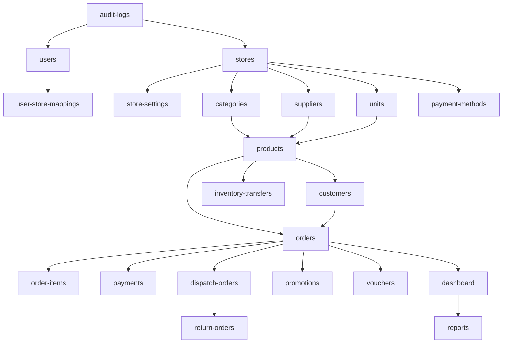

Tôi sẽ phân tích các modules trong thư mục `src/modules` để xác định thứ tự phát triển các chức năng:

Bây giờ tôi sẽ kiểm tra một số README files để hiểu rõ hơn về các modules:

Hãy để tôi kiểm tra một số modules khác để hiểu dependencies:

Bây giờ tôi sẽ phân tích dependencies giữa các modules bằng cách kiểm tra imports:

Dựa trên phân tích các modules và dependencies, tôi sẽ đưa ra **thứ tự phát triển các chức năng** một cách logic và hiệu quả:

## 📊 **Phân tích Module Dependencies và Thứ tự Phát triển**

### 🏗️ **1. FOUNDATION LAYER (Tầng Nền tảng) - Ưu tiên cao nhất**

#### **Phase 1: Core Infrastructure**

```
1. audit-logs          ⭐⭐⭐⭐⭐ (Cần thiết cho tất cả modules)
2. users               ⭐⭐⭐⭐⭐ (Authentication/Authorization)
3. stores              ⭐⭐⭐⭐⭐ (Multi-tenant foundation)
4. user-store-mappings ⭐⭐⭐⭐⭐ (User-Store relationships)
5. store-settings      ⭐⭐⭐⭐⭐ (Store configuration)
```

**Lý do**: Đây là các modules cơ bản nhất, tất cả modules khác đều phụ thuộc vào chúng.

#### **Phase 2: Master Data**

```
6. units               ⭐⭐⭐⭐ (Đơn vị tính - cần cho products)
7. bank                ⭐⭐⭐⭐ (Thông tin ngân hàng)
8. payment-methods     ⭐⭐⭐⭐ (Phương thức thanh toán)
9. categories          ⭐⭐⭐⭐ (Danh mục sản phẩm)
10. suppliers          ⭐⭐⭐⭐ (Nhà cung cấp)
```

**Lý do**: Dữ liệu master cần thiết cho business logic.

### 🛍️ **2. BUSINESS CORE LAYER (Tầng Nghiệp vụ Cốt lõi)**

#### **Phase 3: Product Management**

```
11. products           ⭐⭐⭐⭐⭐ (Sản phẩm - core business)
12. price-histories    ⭐⭐⭐ (Lịch sử giá)
13. stock-adjustments  ⭐⭐⭐ (Điều chỉnh tồn kho)
```

**Lý do**: Products là trung tâm của hệ thống e-commerce.

#### **Phase 4: Customer Management**

```
14. customers          ⭐⭐⭐⭐ (Khách hàng)
15. loyalty-point-logs ⭐⭐⭐ (Điểm thưởng)
```

**Lý do**: Cần có sản phẩm trước khi quản lý khách hàng.

### 🛒 **3. TRANSACTION LAYER (Tầng Giao dịch)**

#### **Phase 5: Order Management**

```
16. orders             ⭐⭐⭐⭐⭐ (Đơn hàng)
17. order-items        ⭐⭐⭐⭐⭐ (Chi tiết đơn hàng)
18. payments           ⭐⭐⭐⭐ (Thanh toán)
19. debt-transactions  ⭐⭐⭐ (Giao dịch công nợ)
20. installments       ⭐⭐⭐ (Trả góp)
```

**Lý do**: Cần có products và customers trước khi tạo orders.

#### **Phase 6: Fulfillment**

```
21. dispatch-orders        ⭐⭐⭐ (Xuất hàng)
22. dispatch-order-items   ⭐⭐⭐ (Chi tiết xuất hàng)
23. return-orders          ⭐⭐⭐ (Trả hàng)
24. return-order-items     ⭐⭐⭐ (Chi tiết trả hàng)
```

**Lý do**: Cần có orders trước khi xử lý fulfillment.

### 📦 **4. INVENTORY LAYER (Tầng Quản lý Kho)**

#### **Phase 7: Inventory Management**

```
25. inventory-transfers      ⭐⭐⭐ (Chuyển kho)
26. inventory-transfer-items ⭐⭐⭐ (Chi tiết chuyển kho)
27. stock-transfer          ⭐⭐⭐ (Chuyển tồn kho)
28. stock-transfer-items    ⭐⭐⭐ (Chi tiết chuyển tồn kho)
```

**Lý do**: Cần có products và orders để quản lý inventory.

### 🎯 **5. MARKETING LAYER (Tầng Marketing)**

#### **Phase 8: Promotions & Vouchers**

```
29. promotions         ⭐⭐⭐ (Khuyến mãi)
30. vouchers           ⭐⭐⭐ (Voucher)
31. voucher-usage-log  ⭐⭐⭐ (Log sử dụng voucher)
32. tag                ⭐⭐ (Tags)
```

**Lý do**: Cần có products và orders để tạo promotions.

### 📊 **6. ANALYTICS LAYER (Tầng Phân tích)**

#### **Phase 9: Reporting & Analytics**

```
33. dashboard          ⭐⭐⭐⭐ (Dashboard tổng quan)
34. dashboard-analytics ⭐⭐⭐ (Analytics chi tiết)
35. report             ⭐⭐⭐⭐ (Báo cáo)
```

**Lý do**: Cần có dữ liệu từ các modules khác để tạo reports.

### 🔧 **7. UTILITY LAYER (Tầng Tiện ích)**

#### **Phase 10: Support Features**

```
36. notification       ⭐⭐⭐ (Thông báo)
37. printing           ⭐⭐⭐ (In ấn)
38. file-attachments   ⭐⭐ (File đính kèm)
39. recreate-order     ⭐⭐ (Tạo lại đơn hàng)
```

#### **Phase 11: System Features**

```
40. job-schedules         ⭐⭐ (Lập lịch công việc)
41. scheduled-task        ⭐⭐ (Task định kỳ)
42. webhook-logs          ⭐⭐ (Webhook logs)
43. external-system-logs  ⭐⭐ (External system logs)
44. user-activity-log     ⭐⭐ (Log hoạt động user)
```

**Lý do**: Đây là các tính năng hỗ trợ, không ảnh hưởng đến core business.

---

## 🎯 **Khuyến nghị Thứ tự Phát triển**

### **🚀 Sprint 1-2: Foundation (2-3 tuần)**

- audit-logs, users, stores, user-store-mappings, store-settings

### **📦 Sprint 3-4: Master Data (2-3 tuần)**

- units, bank, payment-methods, categories, suppliers

### **🛍️ Sprint 5-6: Products (2-3 tuần)**

- products, price-histories, stock-adjustments

### **👥 Sprint 7: Customers (1-2 tuần)**

- customers, loyalty-point-logs

### **🛒 Sprint 8-10: Orders (3-4 tuần)**

- orders, order-items, payments, debt-transactions, installments

### **📦 Sprint 11-12: Fulfillment (2-3 tuần)**

- dispatch-orders, dispatch-order-items, return-orders, return-order-items

### **🏪 Sprint 13-14: Inventory (2-3 tuần)**

- inventory-transfers, inventory-transfer-items, stock-transfer, stock-transfer-items

### **🎯 Sprint 15-16: Marketing (2-3 tuần)**

- promotions, vouchers, voucher-usage-log, tag

### **📊 Sprint 17-18: Analytics (2-3 tuần)**

- dashboard, dashboard-analytics, report

### **🔧 Sprint 19-20: Utilities (2-3 tuần)**

- notification, printing, file-attachments, recreate-order

### **⚙️ Sprint 21-22: System (2-3 tuần)**

- job-schedules, scheduled-task, webhook-logs, external-system-logs, user-activity-log

---

## 🔗 **Dependency Map**



## ⚠️ **Lưu ý quan trọng**

1. **Dependencies**: Luôn phát triển modules dependency trước
2. **Testing**: Test từng module trước khi chuyển sang module tiếp theo
3. **Database**: Tạo migrations theo đúng thứ tự
4. **API**: Đảm bảo API contracts ổn định trước khi modules khác sử dụng
5. **Performance**: Monitor performance khi thêm modules mới

Thứ tự này đảm bảo:

- ✅ Không có circular dependencies
- ✅ Core business logic được ưu tiên
- ✅ Có thể deploy và test từng phase
- ✅ Minimized risk và blocking issues
- ✅ Business value được deliver sớm nhất
